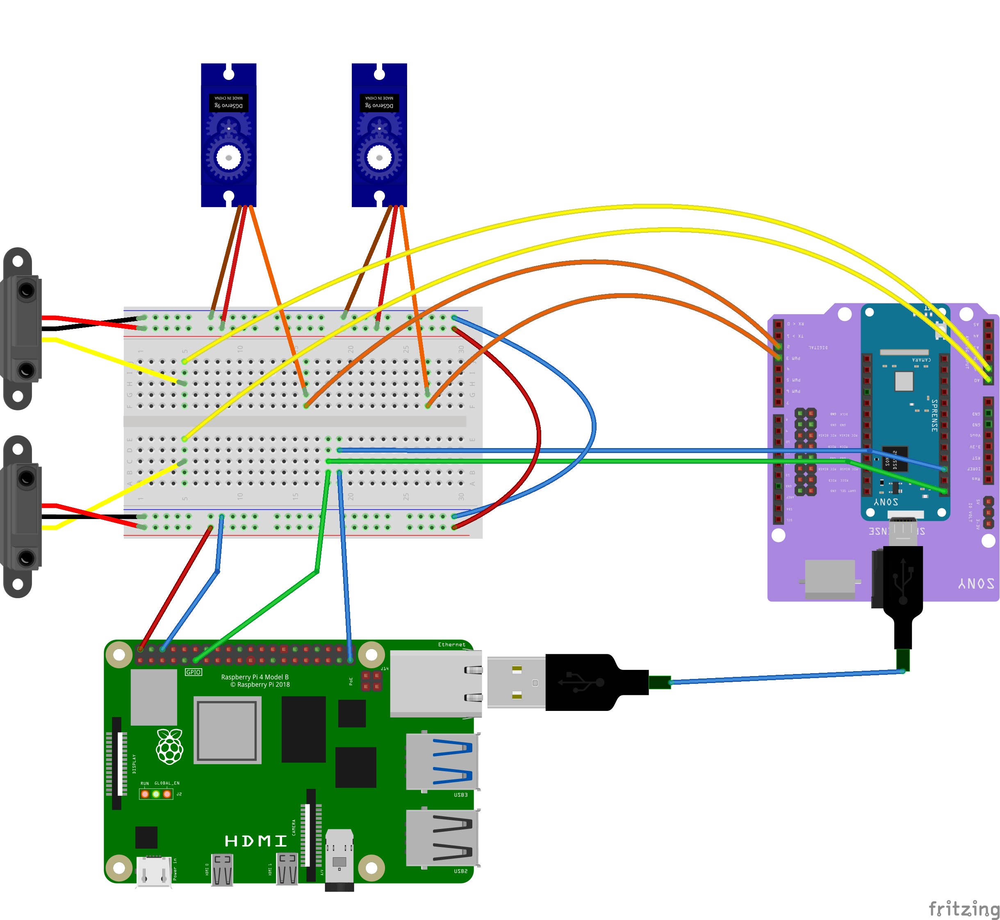

※ The final version is currently under preparation for release.

# Garbage Tracker ：Garbage management feature


## Description
The AI automatically identifies the type of garbage and opens the corresponding door for disposal.<br>
Additionally, it constantly monitors the amount of garbage using distance sensors.

日本語の説明は[こちら](README-ja.md)

## Result
When you press the 'PUSH' button displayed on the screen, it identifies the trash in front of the camera.<br>
The execution result is as follows:<br>
<br>
     

## Requirement
### Hardware
・Raspberry Pi 4<br>
・Spresense (With an expansion board)<br>
・HDR Camera board<br>
・Servo motor (Tower Pro) ×2<br>
・Distance sensor (GP2Y0A21YK) ×2<br>

### Software
・Raspberry Pi OS<br>
・Flask (Please execute 'pip install')<br>
・Arduino IDE

## Preparation on the Raspberry Pi 4
1. Run app.py inside the garbage_flask directory.
```bash
cd garbage_flask
python app.py
```

## Preparation on the Spresense
1. Use the Arduino IDE to upload 'garbage_recognition.ino' from the 'garbage_recognition' directory to the main core.<br>
2. Use the Arduino IDE to upload 'distance_measurement.ino' from the 'distance_measurement' directory to the sub-core.<br>
3. Write 'model.nnb' from the 'garbage_recognition' directory to the SD card for Spresense.

## Wiring instructions
Connect each sensor according to the diagram below.
